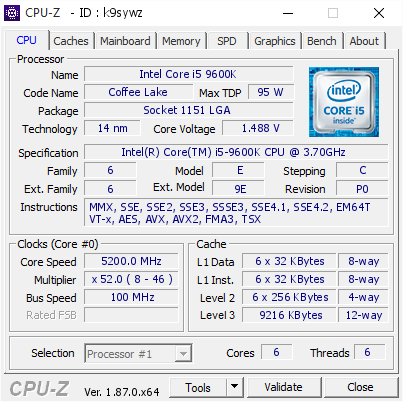
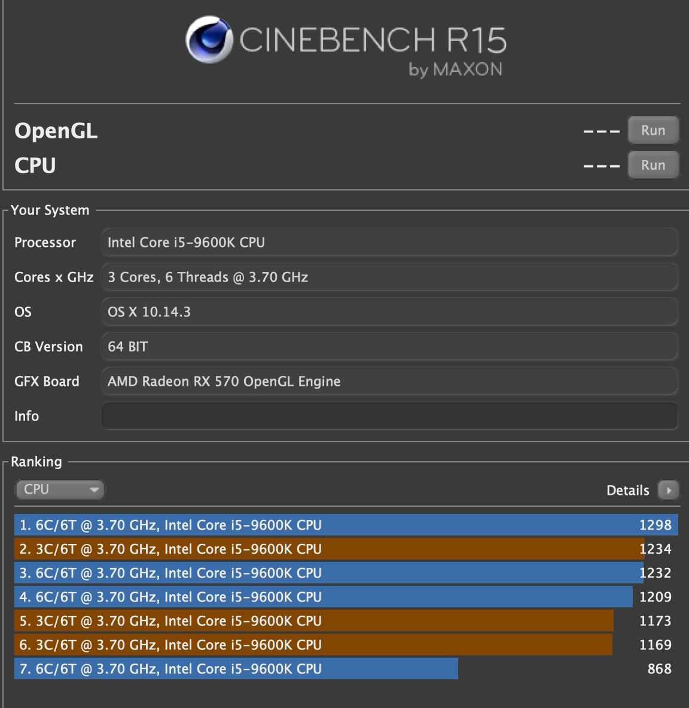

# Benchmarks and results
The results of the benchmarks and the overclocking are listed below. I tried to keep to some of the simpler benchmarking software, I am not going to be doing gaming on this machine, so I did not worry about overclocking the RX 570 too much.

This was on the Gigabyte z390 Gaming SLI mainboard

## Software Used
The testing software used was:
* OS
  * Windows 10
  * OS X Mojave 10.14.3

* Overclocking Tests
  * [Prime95](https://www.mersenne.org/download/)
  * IntelBurnTest
  * Cinebench R15.038 (No Link)
  * [Geekbench 4](https://www.geekbench.com/)
  * [Final Cut Pro](https://www.apple.com/final-cut-pro/)

* Windows Monitoring Apps
  * [cpu-z](https://www.cpuid.com/softwares/cpu-z.html)
  * [hwmonitor](https://www.cpuid.com/softwares/hwmonitor.html)
  * Gigabyte APP Center
  * Gigabyte EZTune - For verifying settings
  * Gigabyte System Information Viewer - For the graphing

* OS X Monitoring Apps
  * HW Monitor (No Fan speeds)
  * iStats Menu (No Fan speeds)

I did not screen cap or save any of the graphs from the Gigabyte System Information Viewer, but it was used for looking at the voltage for the CPU, looking at the temps for the VRM Mostfets and verifying the fan speeds.

## Cooling Configuration
The system is setup with the AIO front mounted, and the fans are mounted in front of the radiator. The AIO then has the fans connected to the motherboard on `SYS_FAN2` and `SYS_FAN3` pins. They are not on the AIO because the AIO was not always spinning the fans in a timely manor, even after configuring the corsair profiles. The motherboard has the fans monitoring the CPU temp, so when the CPU gets warm the fans kick on. The AIO is also plugged into the motherboards `CPU_OPT` pins and that is set to always be on full.

The case has 3 exhaust fans, two top mounted fans that are connected via molex connectors, and one rear fan that is connected to the `SYS_FAN1` and that is set to adjust as the thermal zone for the CPU area gets warm.

The GPU has two fans on board. The only time that I have seen those fans move is when I set the overclock profile that I created. Otherwise the GPU is usually sitting under 55c

## Overclocking
Most of the results are done between 4.8GHz and 5GHz. I did not like that for items with AVX workloads I need to have a special setting for `AVX Offset` that dropped the frequency of the CPU. Prime95 as the stability test was run for 30 minutes if the machine was shown to be stable. To get the machine stable at 5.2GHz I set and AVC Offset of 4. This allowed prime95 to run without crashing, but

The [Bios_Settings.md](Bios_Settings.md) page has the settings used for overclocking.

## Results
Results speak for themselves. And even though in general the 5.2GHz was stable and not that hot, I am still running at 4.8GHz for daily use.

### GeekBench
My geekbench results can be seen at https://browser.geekbench.com/user/smcgroarty  
The highest score on the results was OS X at 5.2Ghz and the lowest results were with the bios set to Optimized Defaults with no overclocking. The latest score was at 4.8GHz done at the time of this typing.

### CPU-Z
 

As you can see from the CPUZ screen shot the voltage was a little high at 1.488V. But all the cores were hitting 5.2GHz but the temp right after validation was 81c and that was a little higher than I wanted for daily use.

### Cinebench
 

Some basic cinebench scores. @4.8Ghz I get around 1170 score in the CPU test. The bigger numbers are the higher overclocks. 5.0 is close to the 1210 mark, while 5.2 peaked at the almost 1300 number. I'm sure I could get the syntheics numbers higher but I really don't need to.

### Games
I don't have any games, but in Windows I can overclock the video card to be the same specs as a RX 580.

### Prime95
at 5.2GHz I ran prime95 for 15 minutes. With the fans going at full speed the MOSFETS reached temps of 120c before I stopped the test. It was a simular result at 5.0GHz after 30 minutes.  
At 4.8GHz prime95 ran fine for over 30 minutes before the MOSFET temps reached 95c. So if you have a board with better power regulation, you should be able to get the 5.0GHz stable.

### Final Cut Pro
The bruce-x test took 20 seconds. A sample video I made in final cut with the export settings of 1080p 24FPS at 22 minutes took 2.5 minutes (Yes two and a half minutes) to export. For comparison, the machine I was coming from would export that same video in 25 minutes.

## Final Thoughts
Overclocking the i5-9600K is fine for the general use I have. I was torn between the i7-8700K and the i5-9600K. I went with the i5 because I did not feel there was $100 performance difference between the two CPUs. Out of the box the CPU would not go past 4.3GHz, so I feel that taking it to 4.8GHz and having it stable is a win.  
I have a 240mm cooler and did not have a lot of issues till I wanted to push it to 5GHz, and then things warmed up quickly. I may get a bigger cooler later to see if I can take it up to 5.2GHz stable. After looking at some of the reviews of other 9th gen Intel CPUs, I see that there is a lot of heat issues with this generation. 
