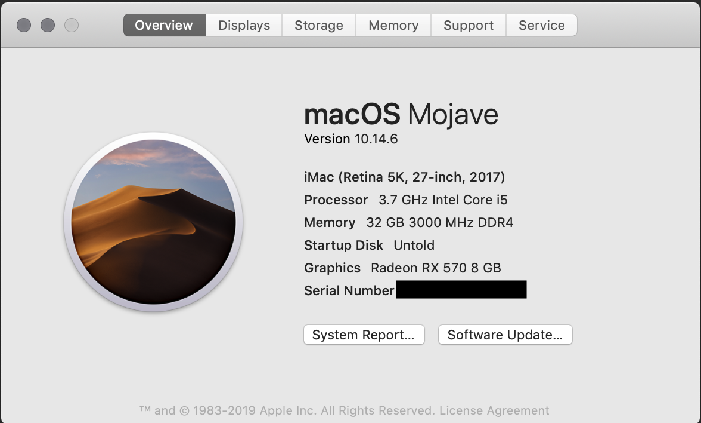

# Hackintosh Mojave Installation Documentation
Primary reference for this guide was from Reddit [Vanilla Install Guide](https://hackintosh.gitbook.io/-r-hackintosh-vanilla-desktop-guide/config.plist-per-hardware/coffee-lake)

This is the hackintosh settings that have worked for me on the Gigabyte z390 Gaming SLI. I will update the docs as things change, but my last hackintosh ran for 4 years without a lot of changes.  
The system has 3 hard drives in it.
* 500GB M.2 SSD - Boot/OS X
* 256GB SATA SSD - Windows
* 2TB SATA 7200RPM - Storage

### Hardware

[Full Hardware List](Hardware.md)
The quick specs are it is a i5-9600K overclocked to 4.8GHz with 32GB RAM on a z390 Gigabyte motherboard and an RX 570 graphics card.
* i5 9600K (@4.8GHz stable and cool)
* Gigabyte z390 motherboard
* 32GB DDR3000
* AMD RX 570
* AIO cooler
* 500GB M.2 SSD
* 2TB 7200RPM
* Broadcom BCM94360CS2 + PCI WiFi+ Bluetooth PCI-E Adapter Card

PC Parts Picker - [https://pcpartpicker.com/list/y7bxBb](https://pcpartpicker.com/list/y7bxBb)

### Bios Settings
[Here](Bios_Settings.md) are all the bios settings I used. I included the overclocking settings.

## What Works and what doesn't

#### Working
* Video - RX 570 and iGPU
* Keyboard - iCue software
* Sleep/Wake - this needed the Corsair iCue software for the keyboard, or it would not wake correctly
* Shutdown
* USB - Ports are set to be a mix of USB2 and USB3 depending on what I plug into them
* Bluetooth - My touchpad works
* Audio - 1220-VB on board/Cinema Display Speakers
* Wifi and Bluetooth - Airport card from Macbook Air
* Quick Preview and Preview
* Final Cut Pro iGPU rendering
* iTunes - I have 1 iTunes TV Show, it worked. iTunes music synced
* App Store - Restore and new purchases
* Continuity/Hand-off/AirDrop/cut+paste
* iMessages

#### Not Working
* Need to boot with verbose
  * No idea on this one
* Fan speeds in HWmonitor
* H100i_v2
  * When connected machine does not sleep

#### Not Tested
* HDMI Output from iGPU - I dont have a screen connected to the iGPU
* File Vault
* Netflix/Hulu/Prime
* Headphones jack

## Clover Configuations
Started with the simple  [Vanilla Clover Config](https://hackintosh.gitbook.io/-r-hackintosh-vanilla-desktop-guide/config.plist-per-hardware/coffee-lake) by [CorpNewt](https://www.reddit.com/user/corpnewt) but it kind of grew into its own thing 
Here is my full [Clover Config.plist](Clover_config.plist.md)

### Resources
There were a lot of [resources] used, check that page for all of them.
